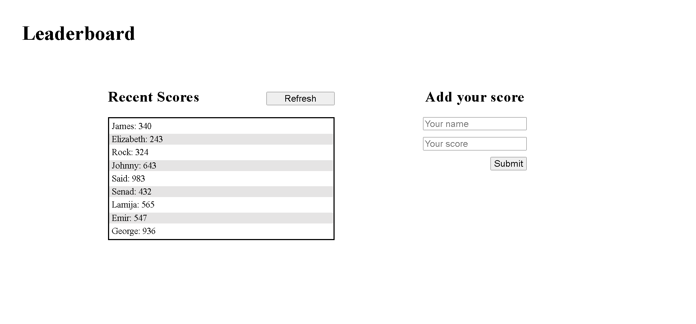

# Leaderboard
The leaderboard website displays scores submitted by different players. It also allows you to submit your score. All data is preserved thanks to the external Leaderboard API service.

## Built With

- HTML
- CSS
- JS/ES6
- Linters
- NPM
- Webpack
- API
- SASS

## Live Demo

[Live Demo Link](https://saidrasinlic.github.io/Leaderboard/)

## Getting Started

To get a local copy up and running follow these simple example steps.

### Prerequisites

- Git/GitHub/VSCode/Linters/ES6/API/Webpack/SASS/NPM (Software Packages System)

### Setup

- gh repo clone SaidRasinlic/Leaderboard

## Authors

👤 **Said Rasinlic**

- GitHub: [@GitHub/SaidRasinlic](https://github.com/SaidRasinlic)
- Twitter: [@Twitter/SaidRasinlic](https://twitter.com/SaidRasinlic)
- LinkedIn: [LinkedIn/SaidRasinlic](https://www.linkedin.com/in/saidrasinlic)

## 🤝 Contributing

Contributions, issues, and feature requests are welcome!

Feel free to check the [issues page](../../issues/).

## Show your support

Give a ⭐️ if you like this project!

## Acknowledgments

- Microverse 

## 📝 License

This project is [MIT](LICENSE) licensed.